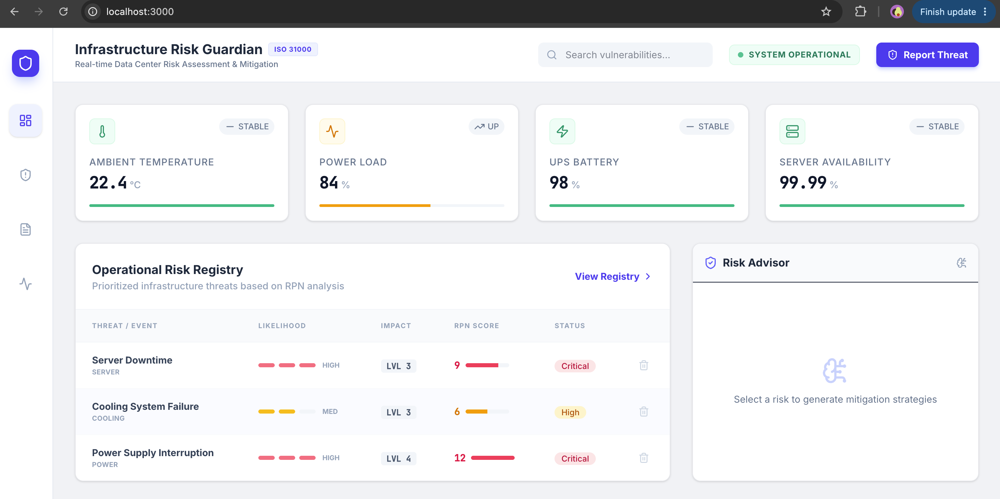
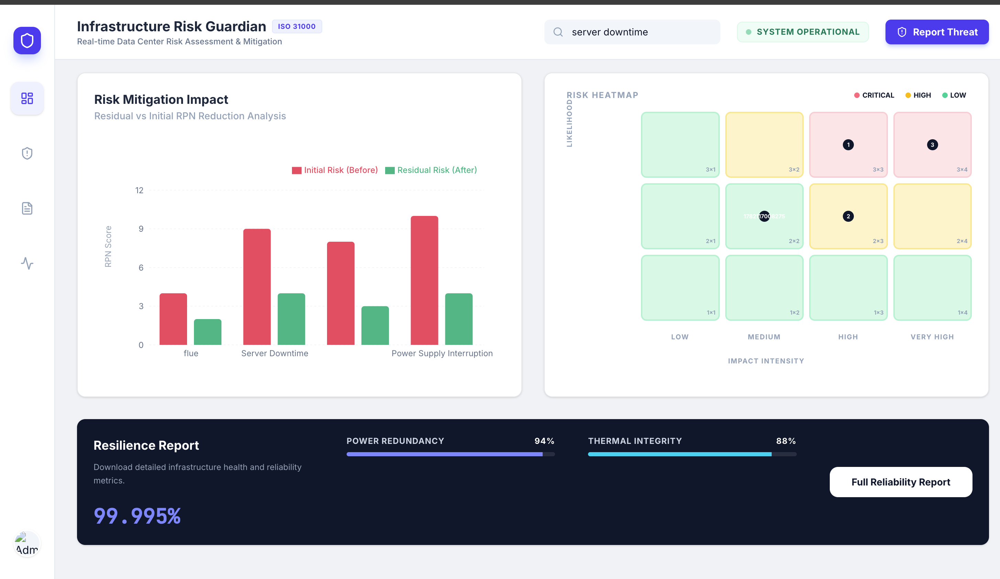
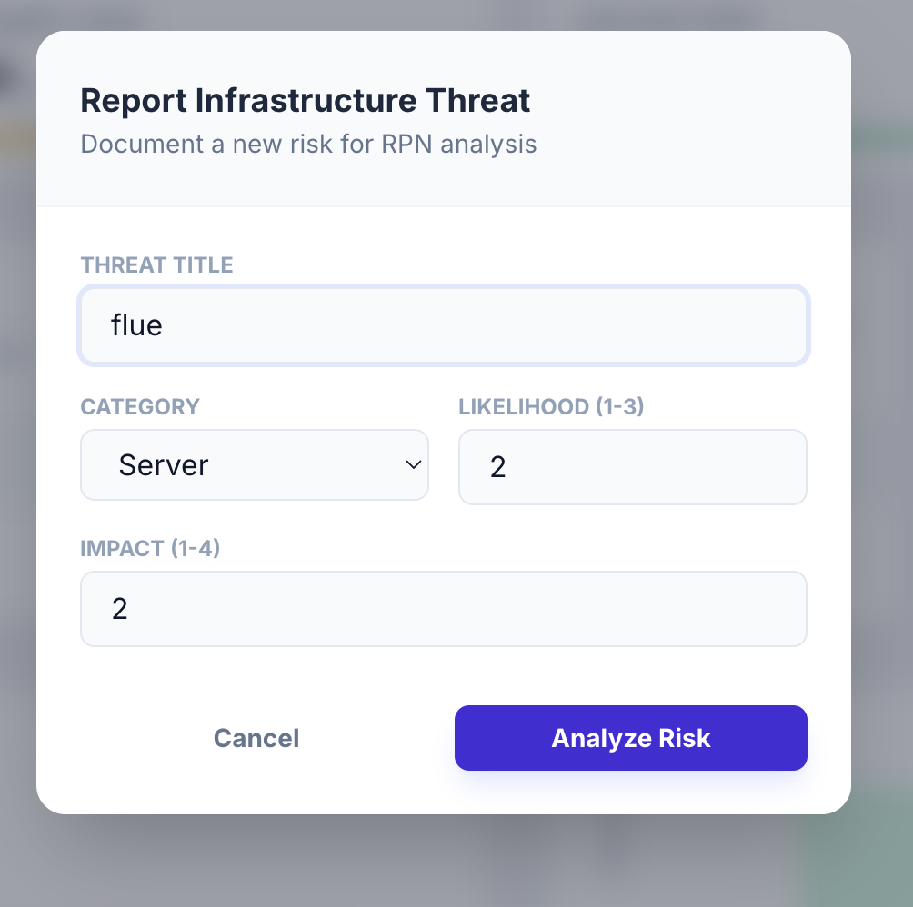

# Infrastructure Risk Guardian

AI-powered risk assessment platform for data center infrastructure that identifies, visualizes, and mitigates operational risks across power, cooling, network, and security systems using real-time analytics and Gemini AI.

## Features

- Real-time infrastructure monitoring
- Dynamic Risk Assessment using RPN scores
- Interactive Risk Matrix visualization
- AI-powered Risk Advisor using Gemini AI
- Trend Monitoring and Analytics
- Comparative Risk Analysis
- Data Center Health Dashboard
- Risk mitigation recommendations

## Tech Stack

- React
- TypeScript
- Vite
- Tailwind CSS
- Gemini AI
- Data Visualization Charts

## Project Modules

### Dashboard
Monitor critical infrastructure metrics such as temperature, power load, UPS battery health, and server availability.

### Risk Matrix
Visualize risks based on likelihood and impact to identify high-priority threats.

### AI Risk Advisor
Get AI-generated recommendations and mitigation strategies for infrastructure vulnerabilities.

### Analytics
Track trends and analyze risk patterns over time.

## Screenshots

### Home Dashboard


### Risk Assessment Results


### Infrastructure Monitoring


## Installation

```bash
npm install
npm run dev
```

## Future Enhancements

- Predictive risk forecasting
- Automated alert system
- Multi-data-center support
- Cloud deployment integration
- Advanced AI-based anomaly detection

## Author

Mahendra Bhattad
